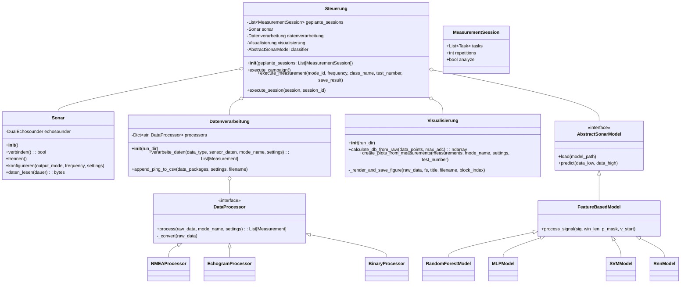

```mermaid
classDiagram
    class Steuerung {
        -List~MeasurementSession~ geplante_sessions
        -Sonar sonar
        -Datenverarbeitung datenverarbeitung
        -Visualisierung visualisierung
        -AbstractSonarModel classifier
        +__init__(geplante_sessions: List[MeasurementSession])
        +execute_campaign()
        +execute_measurement(mode_id, frequency, class_name, test_number, save_result)
        +execute_session(session, session_id)
    }

    class Sonar {
        -DualEchosounder echosounder
        +__init__()
        +verbinden() : bool
        +trennen()
        +konfigurieren(output_mode, frequency, settings)
        +daten_lesen(dauer) : bytes
    }

    class Datenverarbeitung {
        -Dict~str, DataProcessor~ processors
        +__init__(run_dir)
        +verarbeite_daten(data_type, sensor_daten, mode_name, settings) : List[Measurement]
        +append_ping_to_csv(data_packages, settings, filename)
    }

    class Visualisierung {
        +__init__(run_dir)
        +calculate_db_from_raw(data_points, max_adc) : ndarray
        +create_plots_from_measurements(measurements, mode_name, settings, test_number)
        -_render_and_save_figure(raw_data, fs, title, filename, block_index)
    }

    class MeasurementSession {
        +List~Task~ tasks
        +int repetitions
        +bool analyze
    }

    class AbstractSonarModel {
        <<interface>>
        +load(model_path)
        +predict(data_low, data_high)
    }

    class FeatureBasedModel {
        +process_signal(sig, win_len, p_mask, v_start)
    }

    class RandomForestModel
    class MLPModel
    class SVMModel
    class RnnModel

    AbstractSonarModel <|-- FeatureBasedModel
    FeatureBasedModel <|-- RandomForestModel
    FeatureBasedModel <|-- MLPModel
    FeatureBasedModel <|-- SVMModel
    FeatureBasedModel <|-- RnnModel

    class DataProcessor {
        <<interface>>
        +process(raw_data, mode_name, settings) : List[Measurement]
        -_convert(raw_data)
    }

    class NMEAProcessor
    class EchogramProcessor
    class BinaryProcessor

    DataProcessor <|-- NMEAProcessor
    DataProcessor <|-- EchogramProcessor
    DataProcessor <|-- BinaryProcessor
    
    Steuerung o-- Sonar
    Steuerung o-- Datenverarbeitung
    Steuerung o-- Visualisierung
    Steuerung o-- AbstractSonarModel
    Datenverarbeitung o-- DataProcessor
```
