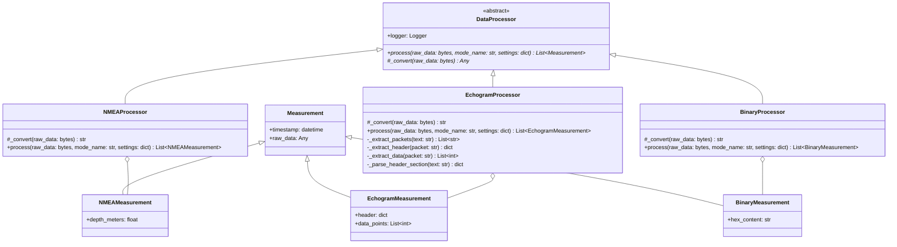

```mermaid
classDiagram
    direction TB
    
    class DataProcessor {
        <<abstract>>
        +logger: Logger
        +process(raw_data: bytes, mode_name: str, settings: dict) List~Measurement~*
        #_convert(raw_data: bytes) Any*
    }

    class NMEAProcessor {
        #_convert(raw_data: bytes) str
        +process(raw_data: bytes, mode_name: str, settings: dict) List~NMEAMeasurement~
    }

    class EchogramProcessor {
        #_convert(raw_data: bytes) str
        +process(raw_data: bytes, mode_name: str, settings: dict) List~EchogramMeasurement~
        -_extract_packets(text: str) List~str~
        -_extract_header(packet: str) dict
        -_extract_data(packet: str) List~int~
        -_parse_header_section(text: str) dict
    }

    class BinaryProcessor {
        #_convert(raw_data: bytes) str
        +process(raw_data: bytes, mode_name: str, settings: dict) List~BinaryMeasurement~
    }

    class Measurement {
        +timestamp: datetime
        +raw_data: Any
    }

    class NMEAMeasurement {
        +depth_meters: float
    }

    class EchogramMeasurement {
        +header: dict
        +data_points: List~int~
    }
    
    class BinaryMeasurement {
        +hex_content: str
    }

    DataProcessor <|-- NMEAProcessor
    DataProcessor <|-- EchogramProcessor
    DataProcessor <|-- BinaryProcessor
    
    Measurement <|-- NMEAMeasurement
    Measurement <|-- EchogramMeasurement
    Measurement <|-- BinaryMeasurement
    
    NMEAProcessor o-- NMEAMeasurement 
    EchogramProcessor o-- EchogramMeasurement 
    BinaryProcessor o-- BinaryMeasurement 
```
