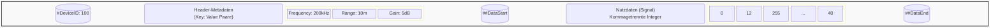

```mermaid
block-beta
columns 1
  block:packet
    style packet fill:#f9f9f9,stroke:#333,stroke-width:2px
    start[("#DeviceID: 100")]
    header("Header-Metadaten<br/>(Key: Value Paare)")
    block:header_content
        h1["Frequency: 200kHz"]
        h2["Range: 10m"]
        h3["Gain: 5dB"]
    end
    marker_start[("##DataStart")]
    data("Nutzdaten (Signal)<br/>Kommagetrennte Integer")
    block:signal_content
        d1["0"] d2["12"] d3["255"] d4["..."] d5["40"]
    end
    marker_end[("##DataEnd")]
  end
```
