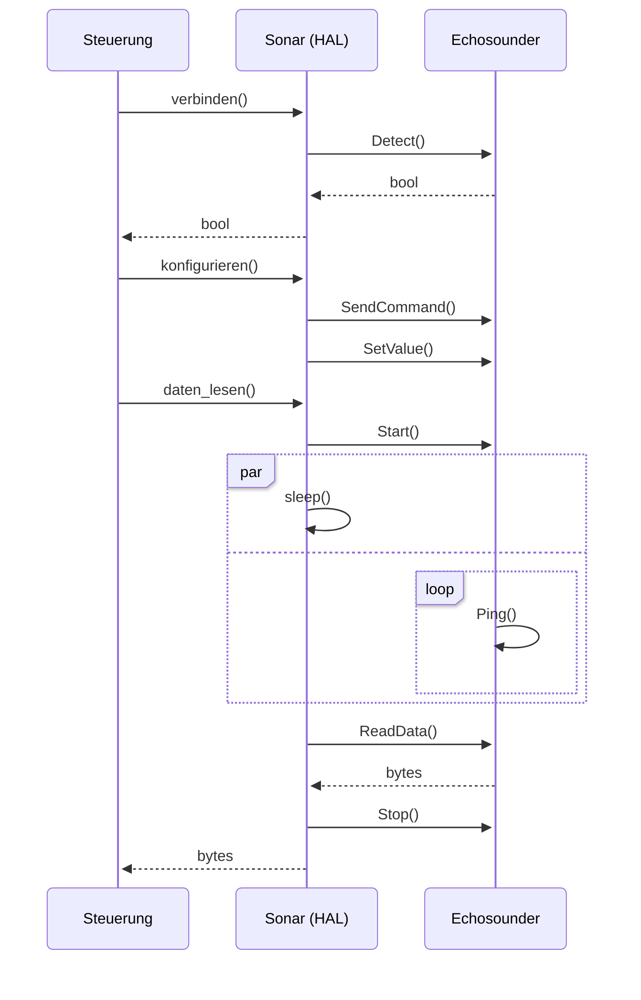

```mermaid
---
config:
  theme: mc
  look: neo
---
sequenceDiagram
    participant Ctrl as Steuerung
    participant Sonar as Sonar (HAL)
    participant Device as Echosounder

    %% Verbindungsaufbau
    Ctrl->>Sonar: verbinden()
    Sonar->>Device: Detect()
    Device-->>Sonar: bool
    Sonar-->>Ctrl: bool
        
    %% Konfiguration
    Ctrl->>Sonar: konfigurieren()
    Sonar->>Device: SendCommand()
    Sonar->>Device: SetValue()
    
    %% Datenlesung
    Ctrl->>Sonar: daten_lesen()
    Sonar->>Device: Start()
    par 
        Sonar->>Sonar: sleep()
    and 
        loop 
            Device->>Device: Ping()
        end
    end
    Sonar->>Device: ReadData()
    Device-->>Sonar: bytes
    Sonar->>Device: Stop()
    Sonar-->>Ctrl: bytes
    
```