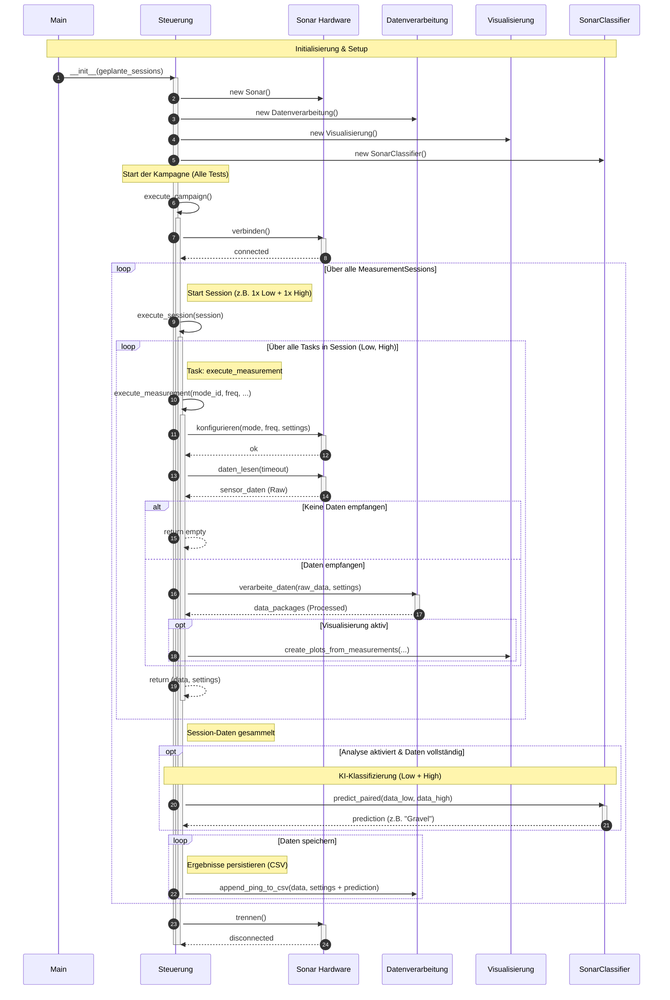

```mermaid
sequenceDiagram
    autonumber
    
    participant Main as Main
    participant Ctrl as Steuerung
    participant Sonar as Sonar Hardware
    participant Data as Datenverarbeitung
    participant Vis as Visualisierung
    participant AI as SonarClassifier

    Note over Main, AI: Initialisierung & Setup

    Main->>Ctrl: __init__(geplante_sessions)
    activate Ctrl
    
    Ctrl->>Sonar: new Sonar()
    Ctrl->>Data: new Datenverarbeitung()
    Ctrl->>Vis: new Visualisierung()
    Ctrl->>AI: new SonarClassifier()
    
    Note over Ctrl: Start der Kampagne (Alle Tests)
    
    Ctrl->>Ctrl: execute_campaign()
    activate Ctrl
    
    Ctrl->>Sonar: verbinden()
    activate Sonar
    Sonar-->>Ctrl: connected
    deactivate Sonar

    loop Über alle MeasurementSessions
        Note right of Ctrl: Start Session (z.B. 1x Low + 1x High)
        Ctrl->>Ctrl: execute_session(session)
        activate Ctrl
        
        loop Über alle Tasks in Session (Low, High)
            Note right of Ctrl: Task: execute_measurement
            Ctrl->>Ctrl: execute_measurement(mode_id, freq, ...)
            activate Ctrl
            
            Ctrl->>Sonar: konfigurieren(mode, freq, settings)
            activate Sonar
            Sonar-->>Ctrl: ok
            deactivate Sonar
            
            Ctrl->>Sonar: daten_lesen(timeout)
            activate Sonar
            Sonar-->>Ctrl: sensor_daten (Raw)
            deactivate Sonar
            
            alt Keine Daten empfangen
                Ctrl-->>Ctrl: return empty
            else Daten empfangen
                Ctrl->>Data: verarbeite_daten(raw_data, settings)
                activate Data
                Data-->>Ctrl: data_packages (Processed)
                deactivate Data
                
                opt Visualisierung aktiv
                    Ctrl->>Vis: create_plots_from_measurements(...)
                end
            end
            
            Ctrl-->>Ctrl: return (data, settings)
            deactivate Ctrl
        end
        
        Note right of Ctrl: Session-Daten gesammelt
        
        opt Analyse aktiviert & Daten vollständig
            Note over Ctrl, AI: KI-Klassifizierung (Low + High)
            Ctrl->>AI: predict_paired(data_low, data_high)
            activate AI
            AI-->>Ctrl: prediction (z.B. "Gravel")
            deactivate AI
        end
        
        loop Daten speichern
            Note right of Ctrl: Ergebnisse persistieren (CSV)
            Ctrl->>Data: append_ping_to_csv(data, settings + prediction)
        end
        
        deactivate Ctrl
    end

    Ctrl->>Sonar: trennen()
    activate Sonar
    Sonar-->>Ctrl: disconnected
    deactivate Sonar
    
    deactivate Ctrl
    deactivate Ctrl
```
