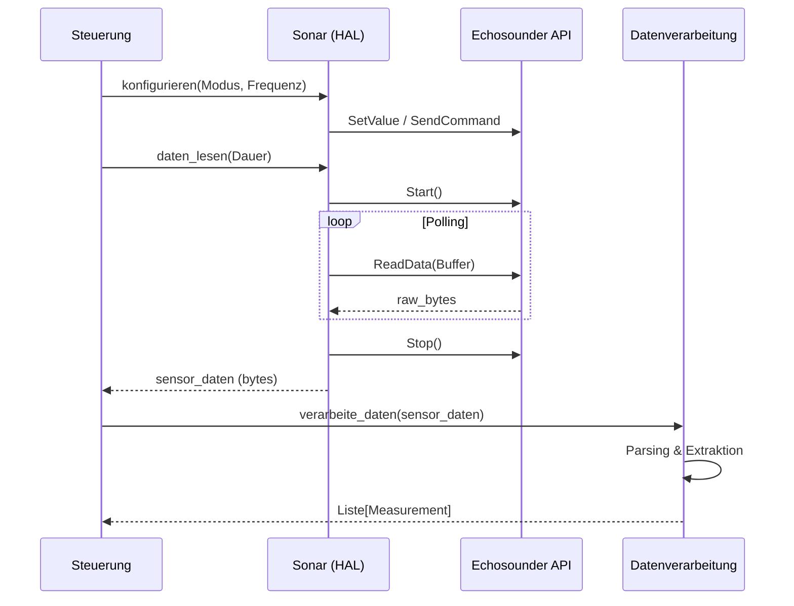

```mermaid
sequenceDiagram
    participant Ctrl as Steuerung
    participant Sonar as Sonar (HAL)
    participant Device as Echosounder API
    participant DV as Datenverarbeitung

    %% 1. Konfiguration
    Ctrl->>Sonar: konfigurieren(Modus, Frequenz)
    Sonar->>Device: SetValue / SendCommand
    
    %% 2. Datenerfassung
    Ctrl->>Sonar: daten_lesen(Dauer)
    Sonar->>Device: Start()
    loop Polling
        Sonar->>Device: ReadData(Buffer)
        Device-->>Sonar: raw_bytes
    end
    Sonar->>Device: Stop()
    Sonar-->>Ctrl: sensor_daten (bytes)

    %% 3. Verarbeitung
    Ctrl->>DV: verarbeite_daten(sensor_daten)
    DV->>DV: Parsing & Extraktion
    DV-->>Ctrl: Liste[Measurement]
```