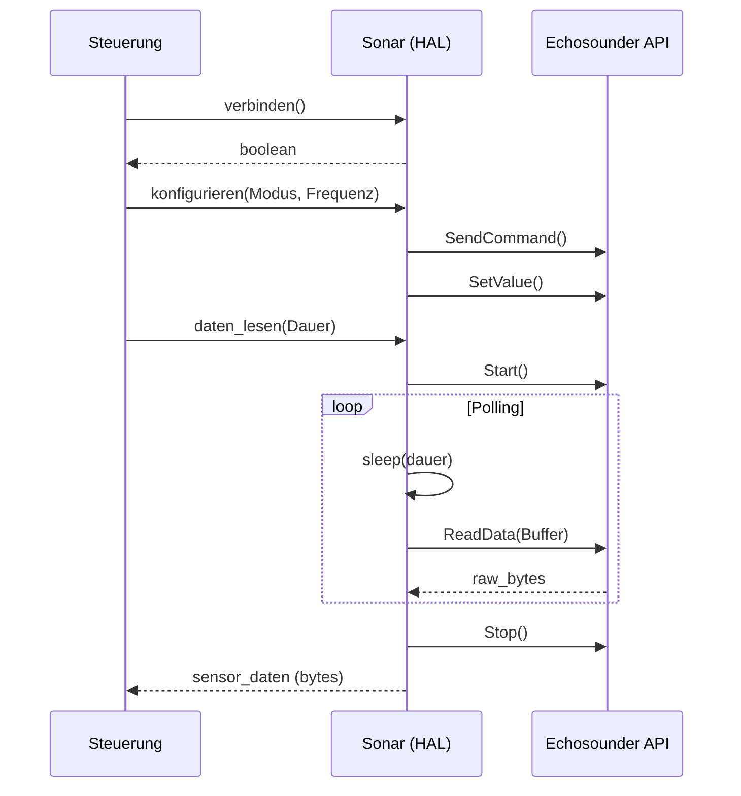

```mermaid
---
config:
  theme: mc
---
sequenceDiagram
    participant Ctrl as Steuerung
    participant Sonar as Sonar (HAL)
    participant Device as Echosounder API

    %% 1. Konfiguration
    Ctrl->>Sonar: verbinden()
    Sonar-->>Ctrl: boolean
    Ctrl->>Sonar: konfigurieren(Modus, Frequenz)
    Sonar->>Device: SendCommand()
    %% 2. Datenerfassung
    Sonar->>Device: SetValue()
    Ctrl->>Sonar: daten_lesen(Dauer)
    Sonar->>Device: Start()
    loop Polling
      Sonar->>Sonar: sleep(dauer)
      Sonar->>Device: ReadData(Buffer)
        Device-->>Sonar: raw_bytes
    end
    Sonar->>Device: Stop()
    Sonar-->>Ctrl: sensor_daten (bytes)

    %% 3. Verarbeitung
```